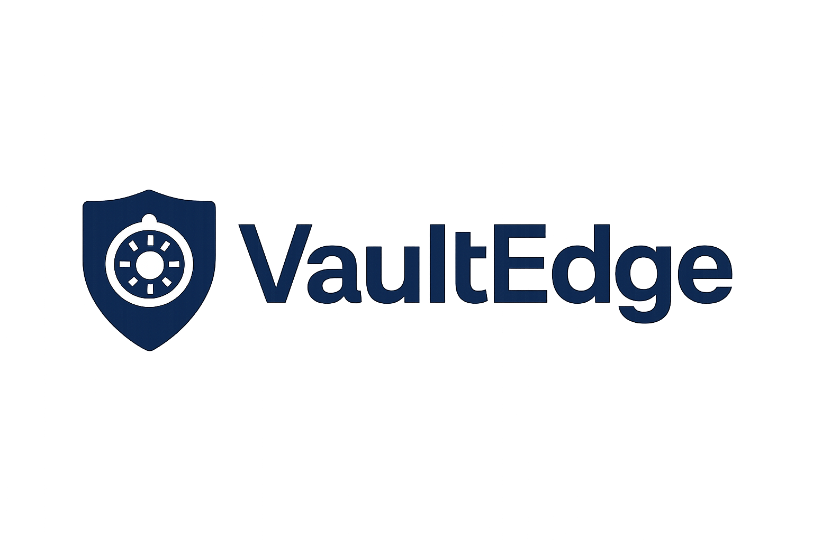

# 🛡️ VaultEdge

**VaultEdge** is a secure, modular, and scalable backend system built with C#. It provides robust user authentication, encrypted vault storage, and a clean RESTful API architecture. Designed for developers who value clarity, extensibility, and performance.

## 🚀 Features

- 🔐 JWT-based authentication and token lifecycle
- 🗄️ Vault item CRUD operations
- 👥 User management and role support
- 🧩 Modular service and repository architecture
- 🧪 Unit and integration tests with xUnit
- 🌐 Swagger-powered API documentation
- 🎨 Branded logo and documentation assets

## 📁 Project Structure

VaultEdge/ ├── VaultEdge.API/ # ASP.NET Core Web API entry point ├── VaultEdge.Core/ # Business logic and interfaces ├── VaultEdge.Data/ # EF Core context and repositories ├── VaultEdge.Security/ # JWT, password hashing, token validation ├── VaultEdge.Common/ # Utilities, extensions, constants ├── VaultEdge.Tests/ # xUnit test suite └── VaultEdge.Docs/ # README, API docs, logo

Code

## ▶️ Getting Started

```bash
cd VaultEdge.API
dotnet run
Visit Swagger UI at:

Code
http://localhost:5289/swagger
🧪 Running Tests
bash
cd VaultEdge.Tests
dotnet test
```

📷 Logo



📜 License
This project is licensed under the MIT License. See LICENSE for details.
